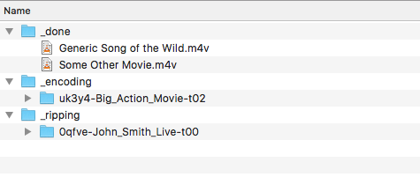
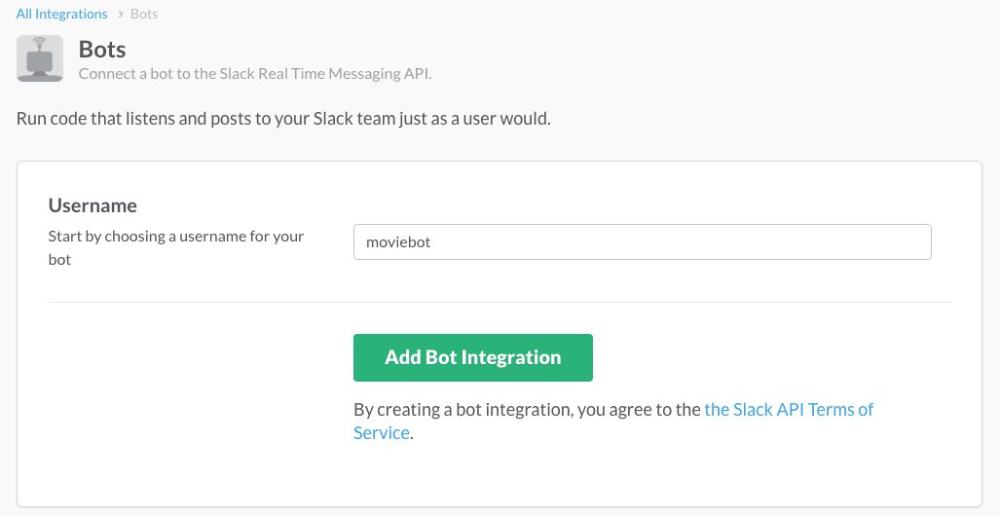

Moviebot
========

Moviebot is a Slack robot that automates the rip and encode of movie DVDs and Blu-rays. Moviebot watches your disc drive and, behind the scenes, uses MakeMKV and Handbrake to stir up beautiful m4v's. Meanwhile you sit on your couch and chat up moviebot, to pick tracks, and rename and move around completed movies. (Let the kids swap discs.)

Encoding (the Handbrake step) can happen in the cloud or locally. Cloud encodes are parallel to each other, and essentially run at the speed your drive can rip. For instance, cloud encoding a season of a TV show is finished shortly after the last episode is ripped, while local encoding might take another 24 hours.

_Note: The following refers to an older Slack setup, using a deprecated API. Will update this text soon._

_Warning: Please observe your country's laws regarding commercial entertainment. You may or may not be able to make backup copies of movies you own._

  * [What it looks like](#what-it-looks-like)
  * [Setting up Moviebot](#setting-up-moviebot)
  * [Commands](#commands)

# What it looks like

_A conversation in your Slack channel._

> **moviebot**  
> Waking up.  

_Automatic detection of discs._
  
> **moviebot**  
> Ooh, a new disc.  
>  
> **moviebot**  
> There's only one show-length track, so I'm going to start ripping it now.  
> 1: Games_of_Nonces_t00.mkv [1:53:51, 26.0G]  
>  
> **moviebot**  
> Starting to rip "Games_of_Nonces_t00.mkv" (with 309G free space).  
>  
> **moviebot**  
> Finished ripping of "Games_of_Nonces_t00.mkv" (took 47m:51s).  
>  
> **moviebot**  
> @channel Ejecting!  Feed me another!  

_Ready for more work once ripping is complete._

> **moviebot**  
> Starting the encode of "Games_of_Nonces_t00.m4v" (with 284G free space).  
>  
> **moviebot**  
> Ooh, a new disc.  
>  
> This disc contains the following tracks:  
> 1) What_Happens_In_A_Place_t00.mkv [1:41:13, 23.7G]  
> 2) What_Happens_In_A_Place_t01.mkv [1:10:45, 15.2G]  
> You can tell me to "rip 1[,2,3,..]" or "rip all" or "eject".  
> @channel (see above)  
>  
> **jeremy**  
> movie rip 1  
>  
> **moviebot**  
> Starting to rip "What_Happens_In_A_Place_t00.mkv" (with 280G free space).  
>  
> **moviebot**  
> Finished ripping of "What_Happens_In_A_Place_t00.mkv" (took 44m:33s).  
>  
> **moviebot**  
> Finished encoding of "Games_of_Nonces_t00.m4v" (took 1h:48m).  

_Encoding happens independently of ripping, queue any number of discs._

> **moviebot**  
> @channel Ejecting!  Feed me another!  
>  
> **moviebot**  
> Starting the encode of "What_Happens_In_A_Place_t00.m4v" (with 250G free space).  
>  
> **moviebot**  
> Finished encoding of "What_Happens_In_A_Place_t00.m4v" (took 1h:33m).  
>  
> **jeremy**  
> movie space  
>  
> **moviebot**  
> I have 269G of free space!  
>  
> **jeremy**  
> movie list  
>  
> **moviebot**  
> Here are your completed shows:  
> 1) A Fine Afternoon  
> 2) Games_of_Nonces_t00  
> 3) What_Happens_In_A_Place_t00  

_Organize your finished movies while others are in-flight._

> **jeremy**  
> movie title 2 3  
>  
> **moviebot**  
> OK, I renamed "Games_of_Nonces_t00" to "Game of Nonces".  
>  
> **moviebot**  
> OK, I renamed "What_Happens_In_A_Place_t00" to "What Happens in a Place".  
>  
> **jeremy**  
> movie archive weepies 1 2  
>  
> **moviebot**  
> OK, added "A Fine Afternoon" to my archive queue.  
>  
> **moviebot**  
> OK, added "Game of Nonces" to my archive queue.  
>  
> **moviebot**  
> Moved "A Fine Afternoon" to weepies (took 58s).  
>  
> **moviebot**  
> Moved "Game of Nonces" to weepies (took 43s).

# Setting up Moviebot

## Clone this repository

    # git clone git@github.com:jeremywohl/moviebot.git

or

    # git clone https://github.com/jeremywohl/moviebot.git

## Prep

Run bundler.

    # bundle install

Copy the sample config.

    # cp config.rb.samp config.rb

Open up `config.rb` and edit MOVIES_ROOT.  Files are in one of three stages: ripping, encoding, and done, and you can watch them move from one to the next.  Here's a sample tree.

You'll need plenty of space -- high bit-rate Blu-rays will need 50GB to rip and compress.

## Setup a Slack team

You'll probably want to [setup a new Slack team](https://slack.com/create) for you or your family/cohorts.  Go do that.

## Create a Bot integration

[Create a Slack bot user](https://my.slack.com/services/new/bot) and copy the API token into `config.rb`.

## Downloads

1. [Download](https://handbrake.fr/downloads2.php) and install Handbrake CLI.
2. [Download](http://www.makemkv.com/download/) and install MakeMKV.

## Final config

Look over the rest of `config.rb`, though the defaults are probably suitable.

## Running

Start 'er up.

    # ./start

At this point, you should see action in your Slack desktop client or web page.

> **moviebot**  
> Waking up.

Now throw a disc into your optical drive.  After it works a bit you should see some results.

> **moviebot**  
> Ooh, a new disc!

Finally, when you need to shut it down:

    # ./stop

# Commands

TODO.  For now, type `movie help` in Slack (or using whatever prefix you chose).
